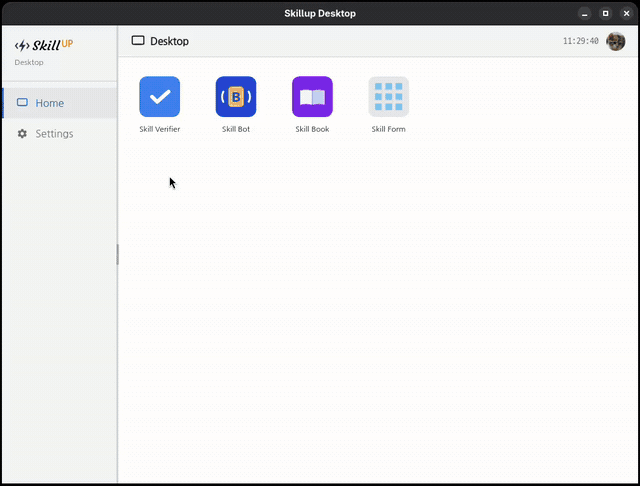

# Skillup

**Skillup** is a desktop platform for Cadence Virtuoso SKILL development tools.

Built on Python + PySide2/PySide6 (Qt WebEngine), it provides a unified launcher for multiple SKILL-focused applications — code editing with live execution, static analysis, and API reference browsing — all in a single, cohesive desktop environment.



> Write, run, and debug SKILL scripts without leaving your desk.

---

## Why Skillup?

Cadence Virtuoso's built-in SKILL environment is powerful, but working with it day-to-day often means switching between a text editor, a terminal, and Virtuoso itself. Skillup brings these together:

- **Write** SKILL code with syntax highlighting in a dedicated editor
- **Run** scripts and see output immediately — no round-trips to the CIW
- **Catch bugs early** with static analysis before loading code into Virtuoso
- **Look up APIs** without leaving your workflow — 8,000+ built-in functions, searchable and browsable

---

## Applications

### Skill Bot — SKILL Debugger

Write, run, and **debug** SKILL scripts directly from the desktop. Syntax highlighting, integrated output panel, and step-through debugging — a full IDE-class experience designed around the SKILL language.

> **No Cadence license required.**
> Unlike Cadence's SKILL IDE, Skill Bot runs entirely outside of Virtuoso.
> Debug your SKILL code freely, on any machine, without consuming a Virtuoso seat.

### Skill Verifier — Static Analyzer

Detects common errors in SKILL code before runtime:

| Check | Description |
|-------|-------------|
| Undeclared variables | Variables used without `let`/`prog` declaration |
| Undefined functions | Calls to functions not defined in scope |
| Parameter redeclaration | Parameters re-declared as local variables |
| Mismatched parentheses | Unbalanced `(` `)` across the entire file |
| Assignments in conditionals | `=` used where `==` or `equal` was likely intended |

Supports CLI and desktop modes. Incremental SQLite-based builds handle large multi-file projects efficiently.

### Skill Book — SKILL Function Reference

A more powerful alternative to Cadence Virtuoso's built-in API Finder.

- Search 8,000+ built-in SKILL functions with full argument descriptions, types, and examples
- **Add your own comments** to any function entry — annotate what you've learned, gotchas, usage tips
- **Mark favorites** to instantly surface the functions you use most
- Keyboard-navigable. Multi-language display (English / 한국어)

> **Need the full 8,000+ function database?**
> Contact [greenfish77@gmail.com](mailto:greenfish77@gmail.com)

### Settings

Global configuration: UI language (English / 한국어), theme, user account, and a system-wide hotkey to bring up Skillup from anywhere on Linux X11.

---

## Requirements

| Component | Requirement |
|-----------|-------------|
| Python | 3.7 or higher |
| Desktop UI | PySide2 **or** PySide6 (see below) |
| Image processing | Pillow ≥ 8.0.0 *(optional — for profile photo resize)* |
| Global hotkey / clipboard | python-xlib ≥ 0.33 *(optional — Linux X11 only)* |

### PySide2 vs PySide6

| | PySide2 | PySide6 |
|---|---|---|
| Python version | 3.7 – 3.10 | 3.9+ |
| Qt version | Qt 5 | Qt 6 |
| Install | `pip install PySide2` | `pip install PySide6` |
| Notes | Required for CentOS 7 / RHEL 7 | Recommended for modern systems |

If both are installed, **PySide2 takes precedence**. The application auto-detects whichever is available.

---

## Installation

```bash
git clone https://github.com/greenfish77/skillup.git
cd skillup

# Choose one — PySide2 (Python 3.7–3.10) or PySide6 (Python 3.9+)
pip install PySide2
# or
pip install PySide6

# Optional dependencies
pip install Pillow          # profile photo resize
pip install python-xlib     # global hotkey / clipboard (Linux X11 only)
```

---

## Usage

### Desktop

```bash
# Launch the desktop
python3 skillup.py --desktop

# Launch and open a specific app on startup
python3 skillup.py --desktop --app:skillbot
python3 skillup.py --desktop --app:skillverifier
```

### skillup-tool (optional)

For site-specific Python interpreter configuration, create a `skillup-tool/` directory as a sibling of `skillup/`:

```
skillup-tool/
    skillup-python-selector.sh   # prints the Python interpreter path to stdout
    skillup-executor.sh          # runs skillup.py with the selected interpreter
skillup/
    skillup.py
    ...
```

**`skillup-python-selector.sh`** — outputs the full path of the Python interpreter to use. Implement this per-site to handle environments where the Python path varies by machine or user:

```bash
#!/bin/bash
echo "/path/to/site-specific/python3"
```

**`skillup-executor.sh`** — reads the interpreter path from `skillup-python-selector.sh` and launches `skillup.py` with any arguments passed to it:

```bash
skillup-executor.sh --desktop         # equivalent to: python3 skillup.py --desktop
skillup-executor.sh --app:skillform   # equivalent to: python3 skillup.py --app:skillform
```

When `skillup-tool/` is in place, skillform callers can use the `*_with_executor()` API to resolve the Python interpreter automatically at runtime, without hardcoding a path:

- **Python**: `SkillForm.with_executor(form_path, skillup_py)` instead of `SkillForm(form_path, skillup_py, python_bin)`
- **SKILL**: `skillformRunWithExecutor(formPath skillupPy handler)` instead of `skillformRun(formPath skillupPy pythonBin handler)`

---

## Roadmap

- Enhanced SKILL debugging support (breakpoints, variable inspection)
- Additional static analysis rules
- Layout automation utilities
- More built-in apps for common SKILL workflows

---

## License

Free for personal and non-commercial use.
Commercial use by organizations requires a separate license.

See [LICENSE](LICENSE) for full terms.
Commercial inquiries: greenfish77@gmail.com
